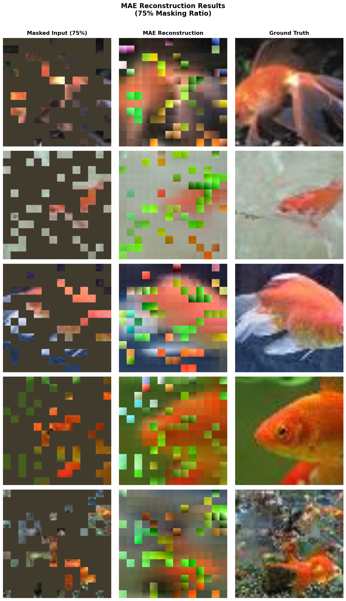
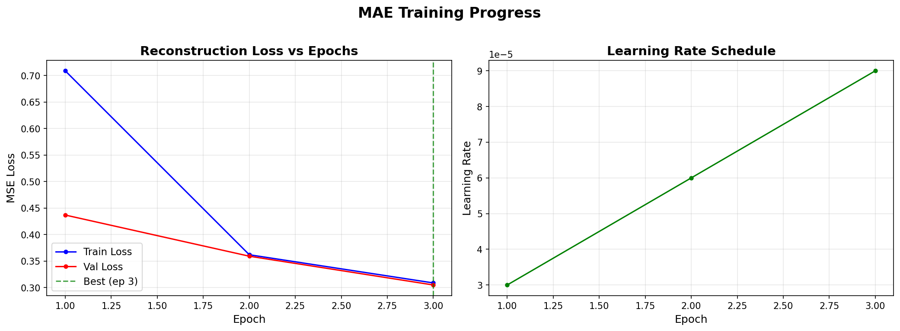
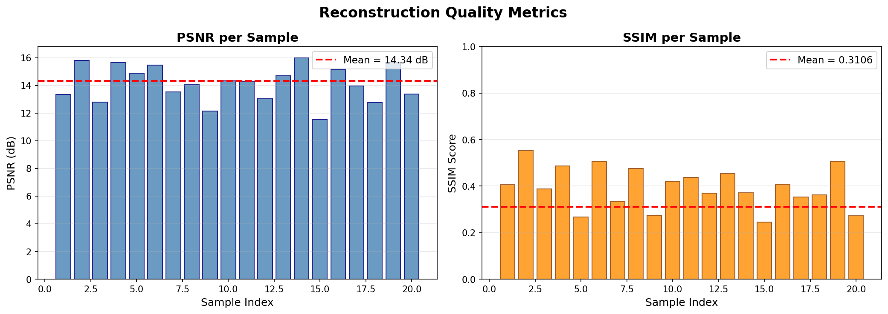

# Self-Supervised Image Representation Learning using Masked Autoencoders (MAE)

## 📌 Overview
This project implements a complete Masked Autoencoder (MAE) system from scratch
using base PyTorch layers. The model learns meaningful visual representations
by reconstructing images where 75% of input patches are masked — without any
labeled data (self-supervised learning).

## 🏗️ Model Architecture
| Component | Model | Hidden Dim | Layers | Heads | Parameters |
|-----------|-------|-----------|--------|-------|-----------|
| Encoder | ViT-Base (B/16) | 768 | 12 | 12 | ~86M |
| Decoder | ViT-Small (S/16) | 384 | 12 | 6 | ~22M |
| **Total** | | | | | **~108M** |

## ⚙️ Configuration
| Parameter | Value |
|-----------|-------|
| Image Size | 224 x 224 |
| Patch Size | 16 x 16 |
| Total Patches | 196 |
| Visible Patches | 49 (25%) |
| Masked Patches | 147 (75%) |
| Batch Size | 32 |
| Optimizer | AdamW |
| Scheduler | Cosine LR + Warmup |
| Mixed Precision | FP16 |

## 📦 Dataset
- **TinyImageNet** (200 classes)
- Train: 100,000 images
- Validation: 10,000 images
- Platform: Kaggle (GPU T4 x2)

## 📊 Results
| Metric | Score |
|--------|-------|
| MSE Loss | 0.299 |
| PSNR | XX dB |
| SSIM | XX |

## 🖼️ Qualitative Results




## 🚀 Gradio App
Interactive web app for real-time image reconstruction:
- Upload any image
- Adjust masking ratio (10% to 90%)
- View masked input, reconstruction, and ground truth side by side

## 🛠️ Tech Stack
- Python 3.12
- PyTorch 2.9
- Torchvision
- Gradio
- Scikit-image (PSNR/SSIM)
- Kaggle (GPU T4 x2)

## 📁 Project Structure
```
├── MAE-Image-Reconstruction.ipynb        — Complete implementation
├── training_curves.png   — Loss and LR plots
├── reconstructions.png   — 5 qualitative samples
├── metrics_chart.png     — PSNR/SSIM charts
└── README.md             — Project documentation


```
## 👥 Authors 
- **Adnan Ali**
- **Muhammad Suleman**
